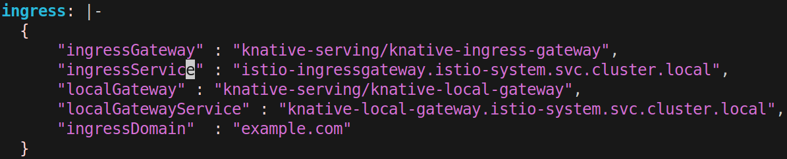
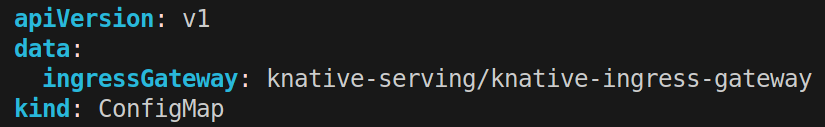
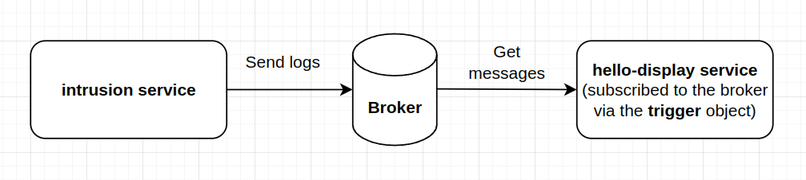

# How-to Guide

## Install Knative Serving

There's no need to install, since it has been already installed along with `minikf`.

## Install KServe

KServe runs on top of Knative Serving, we will install it now.

```shell
kubectl apply -f https://github.com/kserve/kserve/releases/download/v0.7.0/kserve.yaml
```

Apply some RBAC permissions

```shell
kubecl apply -f infra
```

Update some configurations to be compatible with Kubeflow



## Quick start

Create a new namespace containing kserve services
```shell
kubectl create ns kserve-test
```

Deploy your first iris model using the following commands
```shell
kubectl apply -f deployments/quickstart.yaml
```

Port-forward to access the service locally via istio ingress
```shell
kubectl port-forward svc/istio-ingressgateway 8000:80 -n istio-system
```

Test our newly created service by using Python client

```shell
python utils/quickstart/client.py
```

OR `cURL` as below (remember to replace `authservice_session` with your own session)
```shell
curl -v -H "Host: sklearn-iris-kf-user-ui.kubeflow-user.example.com" -H "Cookie: authservice_session=MTY5OTk3MTkzNXxOd3dBTkRORFVWcFBSRVkyUlVaRlIxSXlSMGhGVUVsT1dFUk1XbFpGTWtGWlJUWlRORXRVUVVaUFJrUXlNMVZKUVVwRlRWTk1NMEU9fKd-yLOqo4UjVzu6KpGWV7IyM2lJPsNz5FliyqDEJBT-" http://localhost:8000/v1/models/sklearn-iris-kf-user-ui:predict -d @./iris-input.json
```

## Install pack CLI
[Pack](https://buildpacks.io/docs/tools/pack/) is a tool maintained by the Cloud Native Buildpacks project helps to build images by analyzing the source code.

```shell
sudo add-apt-repository ppa:cncf-buildpacks/pack-cli
sudo apt-get update
sudo apt-get install pack-cli
```
To build an image using `pack`, simple run the following command, then push it as usual.
Pack will read `Procfile` along with `requirements.txt` to build your image.

```shell
pack build --builder=heroku/buildpacks:20 fullstackdatascience/kserve-intrusion-detection:0.0.1
docker push fullstackdatascience/kserve-intrusion-detection:0.0.1
```
Deploy our `instrusion-detection` InferenceService
```shell
kubectl apply -f deployments/intrusion_detection.yaml
```
, and smoke test as follows
```shell
python utils/anomaly/anomaly_client.py
```

## Install KNative for outlier detection

Install Knative Eventing version 0.16.4 as follows. This is referenced from [this tutorial](https://opensource.com/article/21/2/knative-eventing)

```shell
kubectl apply -f https://github.com/knative/eventing/releases/download/v0.16.4/eventing-crds.yaml
kubectl apply -f https://github.com/knative/eventing/releases/download/v0.16.4/eventing-core.yaml
```

Next, install In-Memory Channel and its corresponding broker to store and route messages.There are some types of channels as listed [here](https://knative.dev/docs/eventing/channels/channels-crds/) and brokers [here](https://knative.dev/docs/eventing/brokers/broker-types/channel-based-broker/) 
```shell
kubectl apply -f https://github.com/knative/eventing/releases/download/v0.16.4/in-memory-channel.yaml
kubectl apply -f other-services/knative/mt-channel-broker.yaml
```

After installing all the above manifests, it's time test our system.
```shell
# Create a new namespace
kubectl create ns eventing-test
# Create a new broker of type MTChannelBasedBroker
kubectl apply -f other-services/knative/broker.yaml
# Create a service logging to the broker
kubectl apply -f other-services/knative/logging.yaml
# Create a service hello-display to display messages from the service logging
kubectl apply -f other-services/knative/event-display.yaml
# Create a trigger to subscribe the service hello-display to the broker
kubectl apply -f other-services/knative/trigger.yaml
```

Now, you should see the logs output by the service `logging` from the service `event-display`. You can replace your `outlier-detection` service here.



# Fix some bugs
https://github.com/kserve/kserve/issues/2757